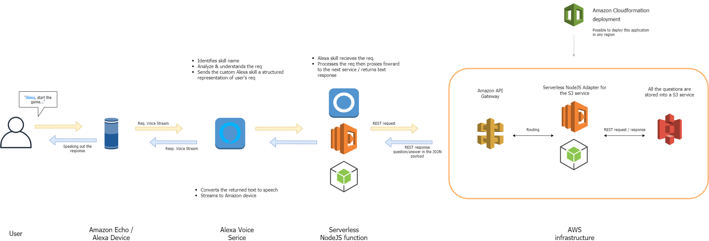

# Amazon Alexa Mythbuster Game

---

This Amazon Alexa skill is based on the well-known Mythbusters television program.

They tested the validity of rumors, myths, movie scenes, adages, Internet videos and news stories. Now, the player have to decide the validity of a randomly given myth.

## Architecture Overview

### Info

- This implementation consists of all the myths from the program.
- The first release will be soon available in the UK.

### Requirement

- You have **an Amazon Alexa Echo / Echo Dot** device
